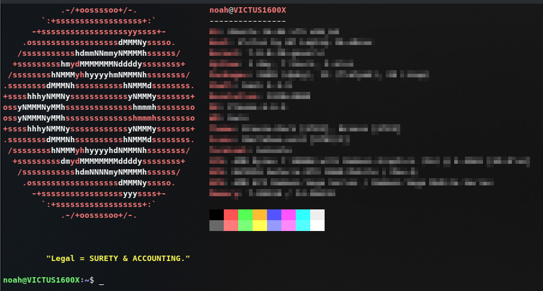

# Shcottisms 

Shcottisms is a short bash script which when executed echoes a random Scottism. 

If you DON'T know what a Scottism is, find out, or remain #NotQualifiedToKnow.



## Installation

Clone the repo:
```bash
git clone https://github.com/7ritz/shcottisms.git
cd shcottisms
```

You can run shcottisms.sh as a standalone script or `cat` the `auto-schcottisms.sh` file to your `~/.bashrc` file for Scottisms to show on terminal startup.

Standalone:
```bash
chmod +x shcottisms.sh
./shcottisms.sh
``` 
On Startup:
```bash
cat auto-shcottisms.sh >> ~/.bashrc 
```
